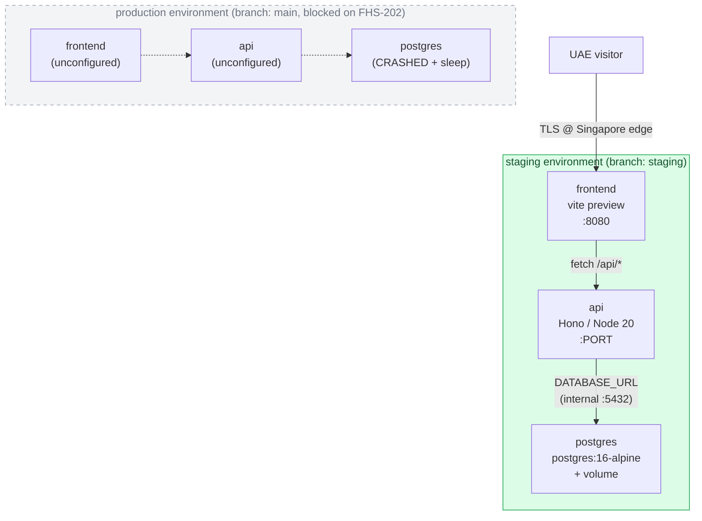

# Deployment topology — Railway

Authoritative reference for the `family-hub-saas` Railway project. Captures
the running infrastructure, env-var matrix, deploy flow, and known
constraints. Update whenever topology changes (add a service, rotate a
secret format, change a branch tracking rule, upgrade plan).

> **Status as of 2026-04-29:** Sprint 0 bootstrap. Trial plan ($5 / 28-day
> cap). Staging-only provisioning — both `api` and `frontend` deploy
> cleanly from the `staging` branch and serve traffic. Production
> environment exists but is intentionally unconfigured pending Hobby-plan
> upgrade — see [FHS-202](https://qualicion2.atlassian.net/browse/FHS-202).

## Project

| Field     | Value                                                                      |
| --------- | -------------------------------------------------------------------------- |
| Name      | `family-hub-saas`                                                          |
| ID        | `bc7e539b-fc8b-4f56-99e2-daffee70138f`                                     |
| Workspace | Trial workspace (1 contributor)                                            |
| Plan      | Trial ($5 cap)                                                             |
| Region    | us-east4 (forced on trial — see [Region constraints](#region-constraints)) |

Created via the Railway MCP server (`@jasontanswe/railway-mcp`)
configured in `.mcp.json` (gitignored — see [`.env.example`](../../.env.example)
for variable names).

## Environments

| Name         | ID                                     | Purpose                                 | Branch           |
| ------------ | -------------------------------------- | --------------------------------------- | ---------------- |
| `staging`    | `3fb76a04-e926-4bdf-ae03-659966366dfb` | Pre-prod, all bootstrap work lands here | `staging`        |
| `production` | `4d84223a-86d3-49ef-a66c-acefe2100158` | GA target — currently unconfigured      | `main` (planned) |

The branching strategy is documented in
[ADR 0006](../decisions/0006-branching-strategy.md): merges land on
`staging` only during bootstrap, then promote to `main` as a single
batch when the W1 vertical slice ships ([FHS-198](https://qualicion2.atlassian.net/browse/FHS-198)).

## Services

Three project-level services, each with one instance per environment.
Railway's model: services are project-scoped; per-environment runtime
config (region, build/start commands, vars, source) lives on the
service instance.



| Service    | ID                                     | Source                           | Image                |
| ---------- | -------------------------------------- | -------------------------------- | -------------------- |
| `postgres` | `e2a7c43f-46db-44e8-bc06-a934fe290699` | —                                | `postgres:16-alpine` |
| `api`      | `7a93c040-1220-4afb-a564-f4cf98901948` | `familyhubapp971/family-hub-app` | —                    |
| `frontend` | `f3048c9c-195b-4141-8cca-daf0f213d6a9` | `familyhubapp971/family-hub-app` | —                    |

### Postgres

Persistent volume `postgres-volume-lbGE`
(ID `0531fd3b-5390-4c40-9a59-36988741cc42`) mounted at
`/var/lib/postgresql/data` in the staging instance. Production instance
has no volume and is set to `sleepApplication: true` (deploys CRASHED on
boot due to missing `POSTGRES_PASSWORD` — intentional, prevents trial
credit drain until [FHS-202](https://qualicion2.atlassian.net/browse/FHS-202)).

> **2026-04-30 password recovery.** Original volume
> `5d88b9b5-28e6-4db5-b252-0836214162cf` was wiped + recreated as
> `0531fd3b-...` after `/api/me` returned 500s tracing back to a
> `SASL: client password must be a string` error: the api's
> `DATABASE_URL` had been stored as a literal with an empty password
> (the cross-service `${{postgres.POSTGRES_PASSWORD}}` reference never
> actually resolved). The fix: set a fresh `POSTGRES_PASSWORD` on the
> postgres service, recreate the volume so the postgres image
> re-initialises with that password, and set `DATABASE_URL` on the api
> as a literal string (not a cross-service reference) including the new
> password. The recipe for any future password rotation is the same —
> see "Rotating postgres credentials" below.

### api

Hono server (Node 20+, ESM). pnpm workspace — depends on
`@familyhub/shared` via `workspace:*`. Build/start config lives at the
service-instance level so per-env overrides are possible later.

The build step bundles via [`apps/api/build.mjs`](../../apps/api/build.mjs)
(esbuild) into a single `apps/api/dist/index.js` so workspace cross-
imports resolve at runtime without exporting unnecessary `dist/` from
`packages/shared`. See [FHS-201](https://qualicion2.atlassian.net/browse/FHS-201).

### frontend

Vite SPA. Built into `apps/web/dist/` and served via `vite preview`
bound to `$PORT`. Public domain
**[`frontend-staging-409d.up.railway.app`](https://frontend-staging-409d.up.railway.app)**
(domain ID `098cbd7e-9a09-40d2-9004-c37bf6a62518`, target port `8080`).

`vite preview` is acceptable for staging but not ideal long-term — it
runs a full Node process to serve static files. Post-upgrade we can
switch to a static-file server (Caddy/nginx) or Railway Edge.

## Build & start commands (staging)

| Service    | Build                                                                               | Start                                                                        |
| ---------- | ----------------------------------------------------------------------------------- | ---------------------------------------------------------------------------- |
| `api`      | `corepack enable && pnpm install --frozen-lockfile && pnpm -F @familyhub/api build` | `pnpm -F @familyhub/api start`                                               |
| `frontend` | `corepack enable && pnpm install --frozen-lockfile && pnpm -F @familyhub/web build` | `pnpm --filter @familyhub/web exec vite preview --host 0.0.0.0 --port $PORT` |
| `postgres` | — (image)                                                                           | — (image entrypoint)                                                         |

`rootDirectory` is left at the default (`/` — repo root) on every
instance because rootDirectory: `apps/api`/`apps/web` would break
pnpm workspace resolution (Railway can't see the workspace packages).

Healthcheck: api uses `/health`
([`apps/api/src/routes/health.ts`](../../apps/api/src/routes/health.ts)).
Frontend has no healthcheck — Railway falls back to TCP-level checks.

### Schema migration on api start

The api `start` script runs `drizzle-kit push --force` _before_
booting the server. Every deploy reconciles the live Postgres schema
against `apps/api/src/db/schema.ts` automatically — no separate
"apply migrations" step, no opportunity for code-vs-database drift to
ship.

This matters because Railway-managed Postgres has no externally
reachable DBA path: the master password is hidden from the dashboard
and there's no proxy enabled by default, so manual `psql` operations
require setting up a TCP proxy + ALTER USER round-trip every time.
Auto-migrate on start avoids the operational tax.

Trade-offs we accepted:

- **`--force` skips destructive-change confirmation prompts.** With
  Sprint 0 schema (one `users` table, no production data), this is
  safe. Pre-launch we move to `drizzle-kit migrate` with explicit
  migration files generated at PR time and applied at deploy time —
  proper change review, no surprises. Tracked as a follow-up.
- **drizzle-kit must remain installed in the runtime image.** Today
  Railway's build runs `pnpm install --frozen-lockfile` (no `--prod`),
  so devDependencies including `drizzle-kit` ship to the container. If
  we ever switch to a prod-only install, drizzle-kit promotes to a
  runtime dependency.
- **First-startup latency adds ~1 s** for the schema reconciliation
  call. Cold starts already take 5–10 s on Railway; the marginal cost
  is invisible.

## Environment variable matrix (staging)

### postgres vars

| Variable            | Source                  | Value                                                                 |
| ------------------- | ----------------------- | --------------------------------------------------------------------- |
| `POSTGRES_USER`     | MCP `variable_bulk_set` | `familyhub`                                                           |
| `POSTGRES_DB`       | MCP `variable_bulk_set` | `familyhub_staging`                                                   |
| `PGDATA`            | MCP `variable_bulk_set` | `/var/lib/postgresql/data/pgdata`                                     |
| `POSTGRES_PASSWORD` | MCP `variable_set`      | (32-char URL-safe random; rotate via dashboard if exposure suspected) |

### api vars

| Variable                    | Source                           | Value                                                                                                                                                                                                      |
| --------------------------- | -------------------------------- | ---------------------------------------------------------------------------------------------------------------------------------------------------------------------------------------------------------- |
| `NODE_ENV`                  | MCP                              | `production` (the api config schema only accepts `development`/`test`/`production`; staging is treated as production-like for strictness)                                                                  |
| `LOG_LEVEL`                 | MCP                              | `info`                                                                                                                                                                                                     |
| `DATABASE_URL`              | MCP (Railway-resolved at deploy) | `postgresql://${{postgres.POSTGRES_USER}}:${{postgres.POSTGRES_PASSWORD}}@${{postgres.RAILWAY_PRIVATE_DOMAIN}}:5432/${{postgres.POSTGRES_DB}}` (see [cross-service references](#cross-service-references)) |
| `PORT`                      | Railway-injected                 | (assigned by Railway, read by [`apps/api/src/config.ts`](../../apps/api/src/config.ts))                                                                                                                    |
| `SUPABASE_URL`              | MCP (FHS-189)                    | `https://maolytpqazmykjzdybtj.supabase.co` (staging Supabase project per [ADR 0008](../decisions/0008-supabase-environments.md))                                                                           |
| `SUPABASE_ANON_KEY`         | MCP (FHS-189)                    | legacy HS256 anon JWT — client-safe role, used for the public-API client                                                                                                                                   |
| `SUPABASE_SERVICE_ROLE_KEY` | MCP (FHS-189)                    | legacy HS256 admin JWT — server-side only, bypasses RLS; **never** mirror onto the frontend service                                                                                                        |
| `SUPABASE_PUBLISHABLE_KEY`  | MCP (FHS-189)                    | modern asymmetric `sb_publishable_…` — client-safe, complement to anon key                                                                                                                                 |
| `SUPABASE_SECRET_KEY`       | MCP (FHS-189)                    | modern asymmetric `sb_secret_…` — server-side only                                                                                                                                                         |

JWT verification is via Supabase's JWKS endpoint at
`$SUPABASE_URL/auth/v1/.well-known/jwks.json` (ES256), not a shared HMAC
secret — `SUPABASE_JWT_SECRET` is therefore not used. See FHS-191 for the
JWKS-cached middleware that lands once auth wiring begins.

### frontend vars

| Variable                        | Source        | Value                                                                 |
| ------------------------------- | ------------- | --------------------------------------------------------------------- |
| `VITE_SUPABASE_URL`             | MCP (FHS-189) | `https://maolytpqazmykjzdybtj.supabase.co` (staging Supabase project) |
| `VITE_SUPABASE_ANON_KEY`        | MCP (FHS-189) | legacy HS256 anon JWT — baked into the browser bundle, safe by design |
| `VITE_SUPABASE_PUBLISHABLE_KEY` | MCP (FHS-189) | modern asymmetric `sb_publishable_…` — baked into the browser bundle  |

The frontend service deliberately gets **only** publishable / anon
client-safe variants. `SUPABASE_SERVICE_ROLE_KEY` and `SUPABASE_SECRET_KEY`
must never be set behind a `VITE_` prefix — Vite inlines `VITE_*` into the
client bundle at build time and exposes them to every browser.

### Production env

Mirrors the staging layout above with the production Supabase project ref
(`bqghmbkoxjompuxixexn`) substituted in for `SUPABASE_URL` /
`VITE_SUPABASE_URL` and the matching `_PRODUCTION` keys for everything
else. Variables are pre-set on the paused production services so the env
is ready when [FHS-202](https://qualicion2.atlassian.net/browse/FHS-202)
unblocks the Hobby-plan upgrade — no separate provisioning step at
unblock time.

### Cross-service references

Railway's `${{serviceName.VAR}}` interpolation lets one service read
another's variables at deploy time. **The service name is lowercase**
and matches what was passed as `name` on `service_create_*`. Empirically
verified at the api service in staging via `list_service_variables`,
where the resolved `DATABASE_URL` showed:

| Token                                  | Resolves to                                                                                                                                                                                                                                                                                                                                                                                                                                                                                                               |
| -------------------------------------- | ------------------------------------------------------------------------------------------------------------------------------------------------------------------------------------------------------------------------------------------------------------------------------------------------------------------------------------------------------------------------------------------------------------------------------------------------------------------------------------------------------------------------- |
| `${{postgres.POSTGRES_USER}}`          | `familyhub` ✓                                                                                                                                                                                                                                                                                                                                                                                                                                                                                                             |
| `${{postgres.POSTGRES_DB}}`            | `familyhub_staging` ✓                                                                                                                                                                                                                                                                                                                                                                                                                                                                                                     |
| `${{postgres.RAILWAY_PRIVATE_DOMAIN}}` | `postgres.railway.internal` ✓                                                                                                                                                                                                                                                                                                                                                                                                                                                                                             |
| `${{postgres.POSTGRES_PASSWORD}}`      | **Empirically did NOT resolve** — `DATABASE_URL` was stored as a literal with an empty password slot, and end-to-end auth requests returned 500 with `SASL: client password must be a string`. The fix (2026-04-30) is to store `DATABASE_URL` on the api as a complete literal string with the password embedded directly, NOT as a cross-service reference. Whether this is a Railway display artefact or a real resolution failure isn't worth chasing further; the literal-string approach works and rotates cleanly. |

### Rotating postgres credentials

When the staging Postgres password needs to change (suspected
exposure, contributor rotation, or after a recovery like the one
that landed alongside FHS-197):

1. Pick a new password (`python3 -c "import secrets; print(secrets.token_urlsafe(32))"`).
2. `mcp__railway__variable_set` `POSTGRES_PASSWORD` on the postgres service to the new value.
3. `mcp__railway__volume_delete` the postgres volume — wipes the on-disk
   user/role with the old password. Acceptable only when staging has
   no irreplaceable data; capture a `pg_dump` first if not.
4. `mcp__railway__volume_create` a fresh volume mounted at `/var/lib/postgresql/data`.
5. `mcp__railway__service_restart` the postgres service — image init
   uses the new `POSTGRES_PASSWORD`.
6. `mcp__railway__variable_set` `DATABASE_URL` on the api service to a
   literal `postgresql://familyhub:<new-password>@postgres.railway.internal:5432/familyhub_staging`.
7. `mcp__railway__service_restart` the api so its connection pool picks
   up the new URL. The auto-migrate-on-start (FHS-197) creates the
   schema on first connect.
8. Verify: `curl https://api-staging-5500.up.railway.app/health` returns 200,
   then a JWT-authenticated `GET /api/me` returns the mirror row.

## Deploy flow

```text
push to staging branch
        ↓
deploymentTrigger fires (per service)
        ↓
Railpack builds image
        ↓
container deployed to staging env
        ↓
healthcheck (api: /health; frontend: TCP)
        ↓
public domain serves traffic
```

Deployment triggers (one per service, per env):

| Trigger ID                             | Service  | Branch    | Repo                             |
| -------------------------------------- | -------- | --------- | -------------------------------- |
| `a97c3872-4e12-46ac-9883-aeb03e1bd15e` | api      | `staging` | `familyhubapp971/family-hub-app` |
| `f3456b7a-d1a6-461c-a222-c3fa6e011550` | frontend | `staging` | `familyhubapp971/family-hub-app` |

Manual deploys can be triggered via the Railway MCP
(`mcp__railway__deployment_trigger` with a commit SHA) or by pushing
the staging branch.

### Branch → environment mapping

| Branch                                              | Environment       | Trigger                                                                                                     | Notes                                                                                                                                                                         |
| --------------------------------------------------- | ----------------- | ----------------------------------------------------------------------------------------------------------- | ----------------------------------------------------------------------------------------------------------------------------------------------------------------------------- |
| `feature/*`, `fix/*`, `docs/*`, `chore/*`, `test/*` | none (no preview) | —                                                                                                           | Verified by CI workflows + local dev. Railway preview environments require a paid plan; we don't use them.                                                                    |
| `staging`                                           | staging           | auto-deploy on push (per-service triggers above)                                                            | All bootstrap work merges here per [ADR 0006](../decisions/0006-branching-strategy.md).                                                                                       |
| `main`                                              | production        | auto-deploy on push (planned, configured during [FHS-202](https://qualicion2.atlassian.net/browse/FHS-202)) | `main` is held at its current commit until the W1 vertical slice ([FHS-198](https://qualicion2.atlassian.net/browse/FHS-198)) is verified, then promoted as one tested batch. |

Feature branches deliberately get no Railway environment. The full
verification matrix is: `pnpm test` (unit + integration locally) → CI
([`.github/workflows/ci-feature.yml`](../../.github/workflows/ci-feature.yml))
on push → CI ([`.github/workflows/ci-pr-staging.yml`](../../.github/workflows/ci-pr-staging.yml))
on PR → manual review → merge to `staging` → first observation in the
real env.

## Rollback

Railway keeps every successful build in the deployment history per
service. The fast path is a **no-rebuild redeploy of the cached image**
(seconds, no CI). The scripted path **rebuilds from source** at an
older commit (slower but works if the cached image was evicted or you
want a fresh build of older code).

### Fast path (Railway dashboard, ~30 seconds)

1. Open [the project dashboard](https://railway.com/project/bc7e539b-fc8b-4f56-99e2-daffee70138f).
2. Pick the broken service (`api` or `frontend`) in the affected
   environment (likely `staging`).
3. **Deployments** tab → find the last known-good deploy
   (status `SUCCESS`, recent timestamp before the regression).
4. Three-dot menu → **Redeploy**. Railway pulls the cached image and
   swaps it in over the bad one. No rebuild.
5. Verify: hit the public domain or `curl <domain>/health` for api.

### Scripted path (Claude / Railway MCP)

The Railway tools below are MCP calls invoked by Claude, not shell
commands. Ask Claude to run them in this order, or call them directly
if you have an MCP-aware client:

| Step                                                     | MCP tool                           | Args (JSON)                                                                     |
| -------------------------------------------------------- | ---------------------------------- | ------------------------------------------------------------------------------- |
| 1. List recent deploys for the broken service            | `mcp__railway__deployment_list`    | `{ "serviceId": "<svc>", "environmentId": "<env>", "limit": 10 }`               |
| 2. Trigger a fresh deploy at the last-good SHA (rebuild) | `mcp__railway__deployment_trigger` | `{ "serviceId": "<svc>", "environmentId": "<env>", "commitSha": "<good-sha>" }` |
| 3. Watch the new deploy                                  | `mcp__railway__deployment_logs`    | `{ "deploymentId": "<returned-id>" }`                                           |

Service / env IDs are listed in the [Services](#services) and
[Environments](#environments) tables above.

For non-MCP environments, the equivalent shell call hits the GraphQL
endpoint directly — see [Operational handles](#operational-handles).

### Git-side rollback (worst case — bad code already on `staging`)

If `staging` itself is poisoned and a future merge would re-break:

1. Identify the bad commit on `staging` (`git log staging`).
2. Open a PR that **reverts** the bad commit — never `git push --force`,
   never `git reset --hard`. Title: `revert: <original commit subject>
(FHS-XXX)`. CI runs as normal.
3. Squash-merge to `staging`. Railway auto-deploys the revert.
4. File a follow-up ticket to fix the underlying bug; the revert is
   not a fix, only a stop-gap.

The same flow applies to `main` once it's live, with `production` as
the deploy target.

### Database rollback

Schema migrations are forward-only. If a migration is broken:

1. Don't reach for a `down` migration — write a **new forward migration**
   that undoes the bad change.
2. If data has been corrupted, restore from Railway's automated Postgres
   backup (Hobby+ plan — not yet available; documented for FHS-202).
3. Until backups are configured, the recovery path is: re-bootstrap the
   staging Postgres volume from the Drizzle schema at
   [`apps/api/src/db/schema.ts`](../../apps/api/src/db/schema.ts).
   Seed scripts to be added under [FHS-168](https://qualicion2.atlassian.net/browse/FHS-168);
   until then, recovery is schema-only and any test data is lost.

## Region constraints

The Railway trial plan does **not** allow region selection. Setting
`region` via either the MCP `service_update` or the GraphQL
`serviceInstanceUpdate` mutation returns success but does **not**
persist — a silent no-op. All workloads run in `us-east4`.

The user-facing edge (TLS termination + static asset cache) is auto-
selected by Railway based on visitor geography. UAE traffic terminates
at `asia-southeast1-eqsg3a` (Singapore), keeping perceived latency
acceptable for an MVP. Origin requests still cross to us-east4
(~120-140 ms from UAE), so any latency-sensitive paths should be
treated with caution until [FHS-202](https://qualicion2.atlassian.net/browse/FHS-202)
unlocks `europe-west4` for closer Middle East peering.

## Cost expectations (trial plan)

- Idle frontend service: ~free (no traffic ⇒ minimal compute)
- Postgres staging: low constant cost (small image, single replica)
- Postgres production: $0 — never wakes (CRASHED + sleep)
- api staging: ~free until [FHS-201](https://qualicion2.atlassian.net/browse/FHS-201) lands and it actually runs

The $5 trial cap is the upper bound until upgrade. Burn rate so far
(2026-04-26 provisioning session): negligible — most credit was
consumed by image pulls and the Postgres staging instance running.

## Logs & monitoring

- **Live logs (per service):** dashboard → service → **Deployments**
  → click latest → **View Logs**. Streams stdout/stderr in real time.
- **Historical logs (scripted):** `mcp__railway__deployment_logs --deploymentId <id>`.
- **api healthcheck:** `GET https://api-staging-5500.up.railway.app/health`
  returns `{ "status": "ok" }`. Use as an uptime probe target.
- **frontend healthcheck:** none beyond TCP — fetch the root URL
  ([frontend-staging-409d.up.railway.app](https://frontend-staging-409d.up.railway.app))
  and assert HTTP 200 with the expected document title.
- **Sentry / structured logging:** wired in [FHS-166](https://qualicion2.atlassian.net/browse/FHS-166)
  and [FHS-167](https://qualicion2.atlassian.net/browse/FHS-167) — until
  those land, Railway's deployment-log view is the only signal.
- **Uptime alerts (FHS-167):** Better Stack / UptimeRobot pings every
  60s on:

  - `https://api-staging-5500.up.railway.app/health` (staging)
  - `https://<api-prod-domain>/health` (production — wires once FHS-202 lands)

  Alert channels: Slack `#family-hub-alerts` + email `oduniyi@gmail.com`.
  Two consecutive failures (~120s) → page; recovery on next OK.
  Configure via the SaaS dashboard; no code or env var needed. Track
  the configured monitor URLs here when set up.

## Operational handles

- **Dashboard:** [railway.com/project/bc7e539b-...](https://railway.com/project/bc7e539b-fc8b-4f56-99e2-daffee70138f)
- **Frontend staging:** [frontend-staging-409d.up.railway.app](https://frontend-staging-409d.up.railway.app)
- **api staging:** [api-staging-5500.up.railway.app](https://api-staging-5500.up.railway.app)
- **Railway MCP:** configured in `.mcp.json` (gitignored). Set `RAILWAY_API_TOKEN` in `.env.local`, then `claude mcp add railway --scope local --env RAILWAY_API_TOKEN=$RAILWAY_API_TOKEN -- npx -y @jasontanswe/railway-mcp`. Verify with `claude mcp list` (expect `railway: connected`).
- **Direct GraphQL:** `https://backboard.railway.com/graphql/v2` with `Authorization: Bearer $RAILWAY_API_TOKEN`. Use for anything the MCP doesn't expose (e.g., `deploymentTriggerCreate`, `serviceInstanceUpdate.region`).

## Runbook: add a new service to staging

The MCP doesn't expose a single "create + connect + deploy" call —
service setup is a 5-step workflow. Capturing it here so it's not
re-derived each time.

1. **Create the service** at the project level:
   - Repo-based: `mcp__railway__service_create_from_repo({ projectId, repo: "familyhubapp971/family-hub-app", name: "<svc-name>" })`
   - Image-based: `mcp__railway__service_create_from_image({ projectId, image: "<image>:<tag>", name: "<svc-name>" })`
   - Capture the returned `serviceId`.
2. **Configure the staging instance** via `mcp__railway__service_update`:
   - Always: `region` (no-op on trial — see [Region constraints](#region-constraints)), `buildCommand`, `startCommand`, `healthcheckPath` if applicable.
   - **Don't** set `rootDirectory` to `apps/<svc>` — it breaks pnpm workspace resolution. Leave at the default `/`.
3. **Wire branch-based deploys** via direct GraphQL (the MCP doesn't expose `deploymentTriggerCreate`):

   ```graphql
   mutation {
     deploymentTriggerCreate(
       input: {
         projectId: "bc7e539b-fc8b-4f56-99e2-daffee70138f"
         environmentId: "3fb76a04-e926-4bdf-ae03-659966366dfb"
         serviceId: "<svc-id>"
         provider: "github"
         repository: "familyhubapp971/family-hub-app"
         branch: "staging"
         checkSuites: false
       }
     ) {
       id
     }
   }
   ```

4. **Set env vars** via `mcp__railway__variable_bulk_set` — secrets must
   not be inlined in the MCP call (transcript exposure); set those via
   the Railway dashboard "Generate" affordance or, if necessary, via
   `mcp__railway__variable_set` accepting the transcript trade-off.
   The full inventory of every variable api / web / tooling read lives
   in [`.env.example`](../../.env.example); `.env.example` is the
   contract, Railway dashboard holds the real values per environment.
5. **Trigger the first deploy** via `mcp__railway__deployment_trigger`
   with the staging branch HEAD SHA, or push to `staging` and let the
   trigger fire automatically. Verify with `mcp__railway__deployment_status`
   and `deployment_logs`.

For image-based services that can't be allowed to also auto-deploy in
the production env (cost reasons during trial), immediately call
`service_update({ environmentId: <production>, sleepApplication: true })`
to neutralize the production instance before it racks up runtime.

## References

- [FHS-156](https://qualicion2.atlassian.net/browse/FHS-156) — Create Railway project (this work)
- [FHS-201](https://qualicion2.atlassian.net/browse/FHS-201) — Fix api production build (blocks staging api deploy)
- [FHS-202](https://qualicion2.atlassian.net/browse/FHS-202) — Configure Railway production post-upgrade
- [FHS-155](https://qualicion2.atlassian.net/browse/FHS-155) — Railway Infrastructure & DNS (parent epic)
- [ADR 0006](../decisions/0006-branching-strategy.md) — branching strategy
